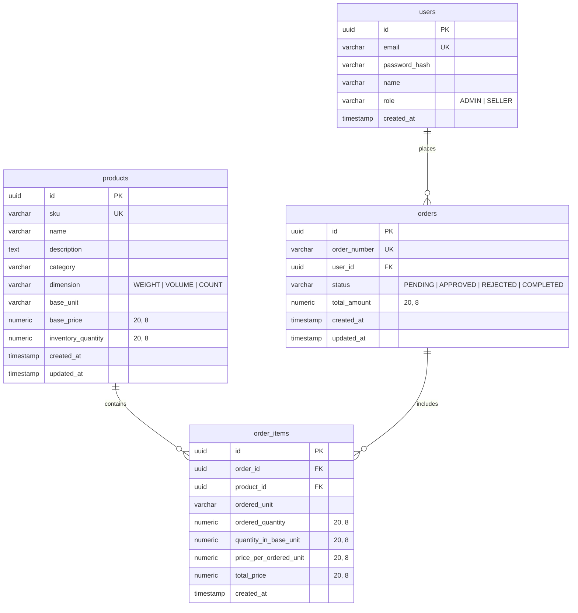

# Inventory & Order Management System

A high-precision sales quotation, inventory tracking, and order management dashboard built with **Next.js (App Router)**, **TypeScript**, **Neon PostgreSQL**, and **Prisma ORM**.

## Live URL
The application is ready for deployment on Vercel. 
- **Deployment URL**: `https://inventory-management-nine-cyan.vercel.app` (or your configure Vercel domain)

---

## 🔐 Demo Credentials

Use these quick-access credentials to test the RBAC interfaces:

| Role | Email | Password | Allowed Access |
| :--- | :--- | :--- | :--- |
| **Admin** | `admin@inventory.com` | `admin123` | Dashboard metrics, Product catalog CRUD, review and status updates of all orders. |
| **Seller Agent** | `seller@inventory.com` | `seller123` | Browsing catalog, real-time conversion previews, shopping cart, submitting quotations, personal order history. |

---

## 🛠️ Tech Stack & Architecture

- **Frontend**: Next.js 16 (React 19) Client Components with **Vanilla CSS** tokens, offering a glassmorphism theme, smooth animations, and responsive layouts.
- **Backend API**: Next.js Route Handlers with secure HTTP-only JWT sessions.
- **Database**: Neon-hosted Serverless PostgreSQL.
- **ORM**: Prisma 7 (using the new `prisma.config.ts` architecture).
- **Authentication**: JWT token cookies signed and verified via the runtime-agnostic `jose` package, intercepting requests at Next.js **Middleware** level for Role-Based Access Control (RBAC).

---

## 📐 Data Modeling & Decimal Precision

To handle high decimal precision and large values without floating-point arithmetic errors, the system enforces the following data structures in PostgreSQL:

- **Prisma Type**: `Decimal` mapped to PostgreSQL **`NUMERIC(20, 8)`**.
  - **Why 20, 8?**:
    - **High Scale (8 decimals)**: Essential for handling fractional conversions (e.g. `1 gram = 0.00100000 kg`) and sub-unit rates without rounding leakage.
    - **Large Precision (20 digits total)**: Accommodates large-scale wholesale stock quantities (up to `999,999,999,999` whole units) and multi-billion INR currency transactions safely.
    - **No Floating-Point Drift**: Standard floating-point values (`DOUBLE PRECISION` or JS numbers) introduce binary representation errors (e.g., `0.1 + 0.2 = 0.30000000000000004`). `NUMERIC` performs exact base-10 mathematics.

---

## ⚖️ Unit Storage & Conversion Strategy

The system handles three dimensions with flexible conversions between dimensions.

### 1. Dimension and Supported Units
- **WEIGHT**: Grams (`g`), Kilograms (`kg`).
- **VOLUME**: Milliliters (`mL`), Liters (`L`).
- **COUNT**: Items (`item`).

### 2. Database Storage Strategy
Products are stored in their native configuration:
- `base_unit`: The unit designated as the product's primary unit (e.g. *Whole Milk* is stored in base unit `L`, while *Vanilla Extract* is in `mL`).
- `base_price`: The rate (₹ per `base_unit`).
- `inventory_quantity`: The stock count (expressed in `base_unit`).

### 3. Conversion Formula Factors
When an order is placed in a unit different from the product's base unit, the system resolves the conversion factor:

| Dimension | Ordered Unit | Base Unit | Multiplier Factor |
| :--- | :--- | :--- | :--- |
| **WEIGHT** | `g` | `kg` | `0.001` |
| | `kg` | `g` | `1000.0` |
| **VOLUME** | `mL` | `L` | `0.001` |
| | `L` | `mL` | `1000.0` |
| **COUNT** | `item` | `item` | `1.0` |

### 4. Code Implementation Points
- **Client-Side Live Preview**: Inside `src/app/seller/page.tsx`, as the user enters a quantity, a reactive calculator queries `getConversionFactor` to show the converted base quantity, converted rate, and the subtotal *before* adding the item to the cart.
- **Backend Transaction Safety**: In `src/app/api/orders/route.ts`, the order submission is enclosed in a **Prisma Database Transaction** (`$transaction`). The backend recalculates conversions, verifies stock availability, and decrements stock. If any check fails, the transaction is completely rolled back, preventing orphaned orders or double deductions.
- **Status Audits**: If an order status is updated to `REJECTED`, the system automatically increments the inventory levels back by the `quantity_in_base_unit` within a transaction.

---

## 📋 Database Schema



---

## 🚀 Setup Instructions

### 1. Prerequisites
- **Node.js**: v18.0.0 or higher (Tested on Node v26)
- **Database**: A Neon PostgreSQL Database instance.

### 2. Local Setup
1. Clone the project files into your workspace.
2. Duplicate `.env.example` to create a `.env` file:
   ```bash
   cp .env.example .env
   ```
3. Insert your Neon connection URL:
   ```env
   DATABASE_URL="postgresql://[user]:[password]@[neon-host]/neondb?sslmode=require"
   JWT_SECRET="make-a-secret-string-minimum-32-chars-long"
   ```
4. Install all dependencies:
   ```bash
   npm install
   ```
5. Apply database schema migrations:
   ```bash
   npx prisma db push
   ```
6. Populate the database with test products and credentials:
   ```bash
   node prisma/seed.js
   ```
7. Fire up the local development server:
   ```bash
   npm run dev
   ```
   Open `http://localhost:3000` in your web browser.

---

## ☁️ Deploy to Vercel

To deploy or redeploy this project onto Vercel:

1. **Prisma configuration adjustment (Already handled)**:
   Prisma 7 uses `prisma.config.ts` for database connection resolution, which prevents bundling secrets in the schema.
2. **Launch deployment**:
   Run the Vercel CLI from the root folder:
   ```bash
   npx vercel
   ```
3. **Environment variables configuration**:
   When prompted, add the environment variables in your Vercel Project Dashboard:
   - `DATABASE_URL` (your Neon connection URL)
   - `JWT_SECRET` (session cookie secret)
4. **Build command verification**:
   The vercel build command is pre-configured to run next-build. Ensure you include `prisma generate` in your build script if required, although Prisma 7 client generation happens automatically on `npm install` post-install scripts.
